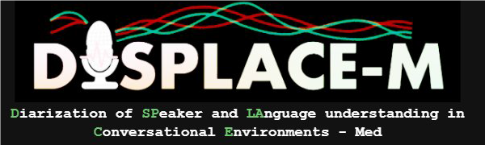

  

# The Third DISPLACE Challenge (2026) - DISPLACE-M
### Diarization and Speech Processing for Language understanding in Conversational Environments – Medical

## About
Inspired by the previous session of DISPLACE challenge, we have launched the third DISPLACE-M 
challenge ([Official Website](https://displace2026.github.io/)). The DISPLACE-M challenge aims to advance diarization 
and speech understanding technologies in real-world healthcare conversations. 
The DISPLACE-M challenge provides a unique dataset of medical conversations between Community 
health workers and local residents in two Indian languages, Hindi and Kannada, collected in a wide 
geographic region covering different dialects. The dataset presents unique challenges such as 
spontaneous dialogue, foreground speech overlap, background speech, dialectal variation, 
and environmental noise in rural healthcare settings, making it an unprecedented resource 
for advancing low-resource, multi-dialect conversational AI.

# Updates
[06/01/2026] : Phase 1 Development Dataset Released.

[08/01/2026] : Baseline 1 Released.

5. Contact Us
    Please reach out to displace2026@gmail.com for any queries.

7. Organizers
    Team DISPLACE-M
    - Prof. Sriram Ganapathy | Associate Professor, LEAP Lab, IISc, Bangalore, India 
    - Dr Dhanya E | Postdoctoral Researcher, LEAP Lab, IISc, Bangalore, India
    - Noumida A | Postdoctoral Researcher, LEAP Lab, IISc, Bangalore, India
    - Ankita Meena | M.Tech Student, IISc Bangalore, India
    - Victor Azad | M.Tech Student, IISc Bangalore, India
    - Manas Sameer Nanivadekar | Research Intern, IISc Bangalore, India
    - Prof. Deepu Vijayasenan | Associate Professor, NITK, Surathkal, India
    - Pratik Roy Chowdhuri | Research Scholar, NITK, Surathkal, India
    - Ashwini Nagaraj Shenoy | Junior Research Fellow, NITK Surathkal, India
    - Supreeth A | Junior Research Fellow, NITK Surathkal, India
    - Dr. Kalluri Shareef Babu | Assistant Professor, UPES Dehradun, India
    - Dr. Srikanth Raj Chetupalli | Assistant Professor, IIT Bombay, India

Indian Institute of Science (IISc), Bangalore-560012, India
National Institute of Technology Karnataka (NITK), Surathkal-575025, India
UPES Dehradun, Uttarakhand-248007, India
Indian Institute of Technology Bombay (IITB), Mumbai-400076, India

########################################################################################