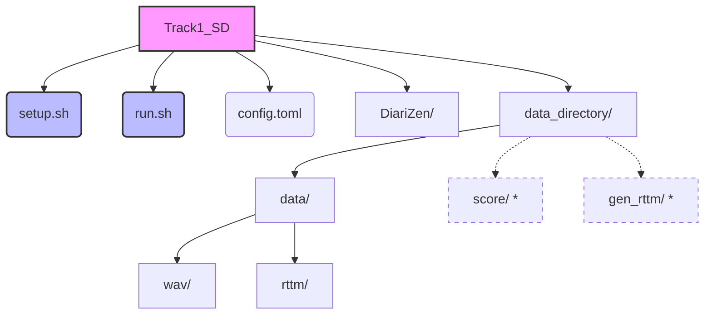

<div align="center">
  <h1>🎙️ Speaker Diarization Baseline</h1>
  <h3>DISPLACE-2026 Challenge (Track 1)</h3>
  <br/>
  
  [](https://opensource.org/licenses/MIT)
  [](https://www.python.org/downloads/release/python-390/)
  [](https://pytorch.org/)
</div>

<hr/>

## 📖 About the Challenge

Inspired by the previous session of the DISPLACE challenge, we have launched the third **DISPLACE-M challenge**. The DISPLACE-M challenge provides a unique dataset of medical conversations between Community health workers and local residents in two Indian languages, **Hindi** and **Kannada**, collected across a wide geographic region covering different dialects.

**Why is it challenging?**
- 🗣️ Spontaneous dialogue & foreground speech overlap
- 🔊 Background speech & environmental noise
- 🌍 Dialectal variations in rural healthcare settings

This dataset is an unprecedented resource for advancing low-resource, multi-dialect conversational AI. Learn more at the [Official Website](https://displace2026.github.io/).

---

## 🎯 Track 1: Speaker Diarization (SD)

**The Task:** Segment multilingual and code-mixed healthcare conversations across diverse dialects and noisy environments based on the speaker.

For this baseline, we leverage the [`wavlm_base_s80_md`](https://huggingface.co/BUT-FIT/diarizen-wavlm-base-s80-md) model from **DiariZen**, developed by the Brno University of Technology, Speech@FIT, Czechia team. For more details on the architecture, refer to the following resources:
- [DiariZen GitHub repository](https://github.com/BUTSpeechFIT/DiariZen)
- Han, Jiangyu, et al. "Leveraging self-supervised learning for speaker diarization." ICASSP 2025. ([Link](https://ieeexplore.ieee.org/abstract/document/10889475))
- Han, Jiangyu, et al. "Fine-tune before structured pruning." arXiv preprint (2025). ([Link](https://arxiv.org/pdf/2505.24111))
- Han, Jiangyu, et al. "Efficient and Generalizable Speaker Diarization." arXiv preprint (2025). ([Link](https://arxiv.org/pdf/2506.18623))

---

## 📂 Directory Structure

Here is an overview of how the repository is structured:



> [!NOTE]
> The `DiariZen/` folder will be downloaded when you run `setup.sh`. The `score/` and `gen_rttm/` folders inside `data_directory/` (indicated by dotted lines) will be generated automatically when running inference via `run.sh`.

---

## 🚀 Setup & Execution

### 1. Clone the Repository

```bash
git clone https://github.com/displace2026/DISPLACE-2026-Baselines.git
cd DISPLACE-2026-Baselines/Track1_SD
```

### 2. Download the Dataset

1. Download **`Track_1_SD_DevData_1`** from the [Official Website](https://displace2026.github.io/). *(Note: Access may require registration and agreement to Challenge Terms)*
2. Create the `data_directory` folder in the project root if it doesn't exist.
3. Copy the `data` folder from your downloaded `Track_1_SD_DevData_1` into `data_directory/`.

Your `data_directory` should now look like this:
```
data_directory/
└── data/
    ├── wav/
    │   └── <Record_ID>.wav
    └── rttm/
        └── <Record_ID>_SPEAKER.rttm
```

### 3. Install Dependencies & Setup Environment

Execute the setup script. This script automatically clones the DiariZen repository and sets up the required `diarizen` Conda environment.

```bash
chmod +x setup.sh
./setup.sh
```

> [!WARNING]
> If you encounter the error: `ERROR: Package 'diarizen' requires a different Python: 3.9.25 not in '>=3.10'`, **do not worry!** You can safely ignore it, as we will use the files from the `diarizen` folder inside the newly created `DiariZen` directory.

### 4. Run Inference & Scoring

If you are using the exact setup above, simply run:

```bash
chmod +x run.sh
./run.sh
```

> [!TIP]
> **Customizing for other tracks?**  
> If generating output for other tracks, open `run.sh` and update:
> - `data_dir_path` (e.g., `../Track2_ASR/data/Track_2_ASR_DevData_1`)
> - `dir_containing_files='Hindi'`
> - `wav_dir='Audio'`

**Where are my results?**
- 📄 **Diarization Output:** `data_directory/gen_rttm`
- 📊 **Scoring Results:** `data_directory/score`
- 🐛 **Logs/Errors:** `data_directory/inf_log.txt` (Inference) and `data_directory/score/final_score.err` (Scoring)

---

## 📈 Evaluation & Expected Output

The performance is evaluated using **Diarization Error Rate (DER)** via [dscore](https://github.com/nryant/dscore):

`DER = False Alarm speech + Missed Speech + Speaker Confusion error`

When you successfully run the pipeline on the Hindi-DEV data, the expected console output will look similar to this:

```text
Overriding with parsed config.
Loaded configuration: {'model': {...}, 'inference': {...}, 'clustering': {...}}
self.embedding: /home/.../pytorch_model.bin
Extracting segmentations.
Extracting Embeddings.
Clustering.
...
Per-file diarization outputs are available in data_directory/gen_rttm
Please refer to inf_log.txt for errors
SCORING ....
************************************************

              OVERALL DER = 10.15                

************************************************
Error and results file present at data_directory/score
```

> [!NOTE]
> For every file processed, the script will output the sequence: `Extracting segmentations.`, `Extracting Embeddings.`, `Clustering.`.

---
<div align="center">
  <i>Developed and maintained by the DISPLACE-2026 Challenge Team.</i>
</div>
