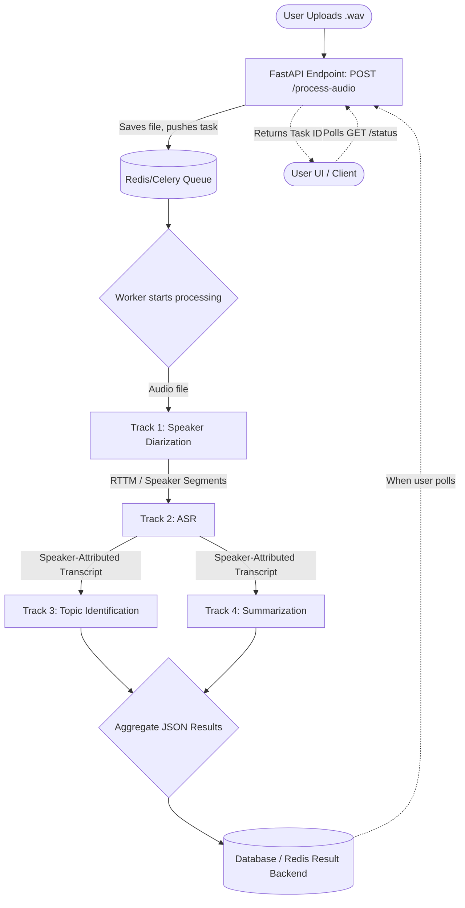

# Microservice Architecture Plan: Cascaded Pipeline for Tracks 1-4

This document outlines the detailed planning, tech stack, and step-by-step implementation guide to build a robust microservice that cascades all 4 tracks (Speaker Diarization, ASR, Topic Identification, and Summarization) from a single `.wav` audio file upload.

---

## 1. Tech Stack Recommendations

To build a smooth, non-interrupting pipeline that can handle heavy Machine Learning processing without timing out, the following stack is recommended:

*   **API Framework**: **FastAPI (Python)**
    *   *Why*: It's lightning-fast, natively supports asynchronous processing, generates automatic interactive API docs (Swagger UI), and plays exceptionally well with Python-based ML models.
*   **Task Queue & Background Processing**: **Celery + Redis**
    *   *Why*: ML inference (especially ASR and Diarization) can take minutes. If you process this synchronously, the HTTP request will time out. Celery allows FastAPI to immediately return a `task_id` to the user while processing the heavy models in the background. Redis will act as the message broker.
*   **Audio Pre-processing**: **Librosa / PyDub / Soundfile**
    *   *Why*: Standard, robust libraries to check sample rates, convert audio formats if a user uploads an `.mp3` instead of `.wav`, and chunk audio if necessary.
*   **Containerization**: **Docker & Docker Compose**
    *   *Why*: Ensures that the microservice runs identically on your local machine, the testing server, and production without "it works on my machine" library mismatch errors.

---

## 2. Architecture Flowchart

Below is a visual representation of the cascade. You can use a markdown viewer (or GitHub) to see this Mermaid.js flowchart natively.



---

## 3. Model Weight & Artifact Management

**No Manual Weight Management Required:**
You **do not** need to manually create, save, or upload any `.pth` or `.bin` files to your repository or a dedicated weights folder.

**How Your Models Currently Work:**
All four of the tracks utilize the **Hugging Face Hub** dynamically:
*   **Track 1 (Speaker Diarization)** uses `hf_hub_download` inside `DiariZen/inference_withConfigFile.py` to automatically fetch `pytorch_model.bin`.
*   **Track 2 (ASR)** uses `AutoModel.from_pretrained()` inside `transcribe_segments.py` to fetch the ASR model.
*   **Track 3 (Topic ID)** uses `AutoModelForCausalLM.from_pretrained()` to load a LLaMA-based causal language model.
*   **Track 4 (Summarization)** uses the Hugging Face `pipeline("summarization", ...)` inside `summarizer.py`.

**How We Will Handle This in the Microservice:**
Because your tracks already use Hugging Face's automated system, the weights (`.bin`, `.safetensors`, `.pth`) are downloaded automatically the *very first time* you run the scripts, and they are saved locally to your system's global cache directory (usually `C:\Users\Hp\.cache\huggingface\hub\`).

When we build the microservice (using Docker):
1.  **No Code Changes Needed**: We won't need to change any of the track files. We will just import your existing Python classes.
2.  **Volume Mapping**: Instead of manually copying `.pth` files around, we will simply map your computer's Hugging Face cache folder into the microservice Docker container as a volume.
3.  **Result**: The microservice will instantly see the previously downloaded weights and load them straight into the GPU/RAM. The model weight management is entirely handled by Hugging Face's native caching!

---

## 4. Detailed Step-by-Step Implementation Plan

### Step 1: Project Setup and Skeleton
1. Initialize a new Python virtual environment.
2. Install dependencies: `pip install fastapi uvicorn celery redis pydantic python-multipart`.
3. Create the basic directory structure:
   ```text
   microservice/
   ├── app/
   │   ├── main.py           # FastAPI entry point
   │   ├── worker.py         # Celery tasks and queue config
   │   ├── models/           # Pydantic schema definitions
   │   └── core/             # Wrappers for Track 1, 2, 3, 4 ML models
   ├── requirements.txt
   └── docker-compose.yml
   ```

### Step 2: Adapt Existing Tracks into Callable Modules
Currently, your tracks are likely standalone scripts designed to run on folders of data. You need to refactor them into functions that can accept a single file path or in-memory audio object and return a Python dictionary/string.
*   **Track 1 (SD)**: Function takes `audio_path`, returns a list of dictionaries with `[start_time, end_time, speaker_id]`.
*   **Track 3 & 4**: Functions take `transcript_text`, return `topic_label` and `summary_text` respectively.

### Step 3: Implement the FastAPI Endpoints
Create two primary API endpoints in `main.py`:
1.  `POST /api/v1/analyze`:
    *   Accepts a file upload (`UploadFile` in FastAPI).
    *   Validates it is a `.wav` file.
    *   Saves the file temporarily to disk.
    *   Sends the file path to the Celery worker.
    *   Returns a `task_id` and a `202 Accepted` status immediately.
2.  `GET /api/v1/status/{task_id}`:
    *   Checks the status of the Celery task (e.g., "PENDING", "PROCESSING_ASR", "COMPLETED").
    *   If completed, returns the final aggregated JSON (Transcripts, Topics, Summary).

### Step 4: Implement the Celery Worker Pipeline
In `worker.py`, define the sequential execution:
```python
@celery_app.task(bind=True)
def process_audio_pipeline(self, audio_file_path):
    # 1. Run Track 1 (Diarization)
    self.update_state(state='DIARIZATION')
    speaker_segments = run_track1_sd(audio_file_path)
    
    # 2. Run Track 2 (ASR)
    self.update_state(state='ASR')
    transcript = run_track2_asr(audio_file_path, speaker_segments)
    
    # 3. Run Track 3 & 4 in parallel or sequentially
    self.update_state(state='NLP_PROCESSING')
    topics = run_track3_ti(transcript)
    summary = run_track4_ds(transcript)
    
    return {
        "status": "success",
        "transcript": transcript,
        "topics": topics,
        "summary": summary
    }
```

### Step 5: Containerization (Docker)
Write a `Dockerfile` for the FastAPI app and Celery workers, and a `docker-compose.yml` to spin up Redis, the API server, and the worker seamlessly. This will prevent memory leaks between executions and make deployment a breeze.

### Step 6: Error Handling & Edge Cases
*   **Large Files**: Set a max file size limit on the API.
*   **Corrupt Audio**: Catch audio decoding exceptions in the worker and return a clear `FAILED` status.
*   **GPU Memory**: Ensure that the Celery concurrency is limited (e.g., `concurrency=1` or `2`) so multiple simultaneous uploads don't cause an Out-Of-Memory (OOM) error on your GPU.

---

### Next Steps
Once you are ready to start coding this, let me know! We can begin by setting up the FastAPI + Celery skeleton (Step 1 & 3), and then slowly map your existing models from the `Track1_SD` to `Track4_DS` folders into it.
