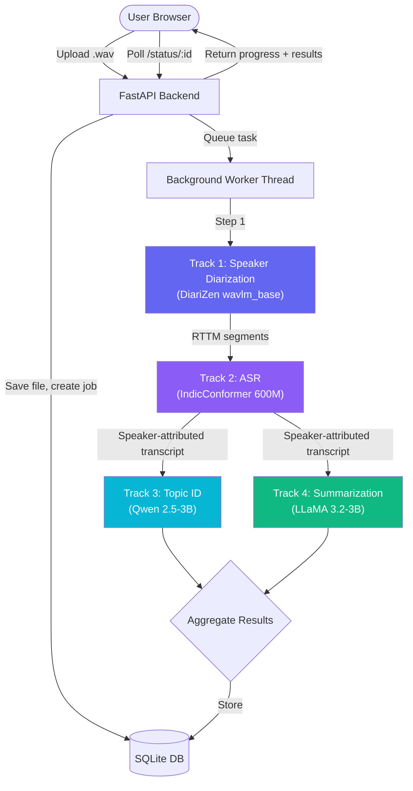

# DISPLACE MedAI – Audio Analysis Microservice

Build a premium, GPU-accelerated microservice that processes raw `.wav` healthcare conversations through a 4-stage ML pipeline (Speaker Diarization → ASR → Topic Identification → Dialogue Summarization) and presents results through a stunning, real-time web UI.

---

## UI Design Vision

### Main View – Upload & Pipeline Progress


### Results View – Transcript & Summary


### UI Layout Summary

| Area | Content |
|------|---------|
| **Nav Bar** | Logo gradient icon + "DISPLACE MedAI" branding, GPU/system status indicator |
| **Left Panel (40%)** | Drag-and-drop audio upload zone, audio waveform player, "Process Audio" button |
| **Right Panel (60%)** | Tabbed results: **Pipeline Status** (live stepper), **Transcript** (speaker-colored chat bubbles with timestamps), **Topics** (extracted medical problems), **Summary** (structured clinical summary) |
| **Theme** | Dark mode (#0f172a), glassmorphism cards, indigo/violet/cyan gradients, Inter font |

---

## Architecture Overview



---

## User Review Required

> [!IMPORTANT]
> **Project Location**: The new microservice will be built inside the workspace at `c:\Users\Hp\DISPLACE-2026-Baselines\microservice\`. This keeps it co-located with the track folders so we can import model code directly. Is this location acceptable, or do you prefer the existing `c:\Users\Hp\OneDrive\Desktop\Micro-Service\` location?

> [!IMPORTANT]
> **Model Loading Strategy**: All 4 models will be loaded from the HuggingFace cache (`~/.cache/huggingface/hub/`). The first run will download models if not cached. Models stay in GPU VRAM between requests for fast inference. Given the ~14GB+ combined VRAM requirement (DiariZen ~1GB, IndicConformer ~2.5GB, Qwen-3B ~6GB, LLaMA-3B ~6GB), do you have enough GPU memory to keep all loaded, or should we load/unload models on-demand per pipeline stage?

> [!WARNING]
> **No Redis/Celery for local dev**: The existing [base_plan.md](file:///c:/Users/Hp/DISPLACE-2026-Baselines/base_plan.md) suggests Celery + Redis. For local GPU development, I recommend **FastAPI BackgroundTasks + threading** instead – simpler setup, no external services needed. We'll add Celery when you move to cluster deployment. Agree?

---

## Open Questions

1. **HuggingFace Token**: Your Track 2/3/4 models require a HF token for gated model access. Do you have one configured already, or should the app prompt for it on first launch?

2. **Audio Language**: The ASR model (IndicConformer) requires a `language_id` parameter (`"hi"` for Hindi, `"kn"` for Kannada). Should the UI let users select the language, or auto-detect?

3. **Concurrent Users**: For local dev, should we enforce single-job-at-a-time processing (simpler, no GPU contention), or allow queuing multiple jobs?

---

## Proposed Changes

### Project Structure

```text
c:\Users\Hp\DISPLACE-2026-Baselines\microservice\
├── backend/
│   ├── app/
│   │   ├── __init__.py
│   │   ├── main.py                    # FastAPI entry point
│   │   ├── config.py                  # Pydantic settings (HF token, device, model paths)
│   │   ├── database.py                # SQLite + SQLAlchemy for job tracking
│   │   ├── models.py                  # DB models (Job, TranscriptSegment)
│   │   ├── schemas.py                 # Pydantic request/response schemas
│   │   ├── routes/
│   │   │   ├── __init__.py
│   │   │   ├── audio.py               # POST /api/upload, POST /api/process
│   │   │   └── jobs.py                # GET /api/jobs/:id, GET /api/jobs/:id/results
│   │   ├── services/
│   │   │   ├── __init__.py
│   │   │   ├── pipeline.py            # Orchestrator: chains Track 1→2→3→4
│   │   │   ├── diarization.py         # Wrapper around Track1_SD DiariZen
│   │   │   ├── transcription.py       # Wrapper around Track2_ASR IndicConformer
│   │   │   ├── topic_extraction.py    # Wrapper around Track3_TI Qwen
│   │   │   └── summarization.py       # Wrapper around Track4_DS LLaMA
│   │   └── worker.py                  # Background task runner
│   ├── requirements.txt
│   └── run.py                         # uvicorn launcher
├── frontend/
│   ├── index.html                     # Single-page application
│   ├── css/
│   │   └── styles.css                 # Complete design system
│   └── js/
│       ├── app.js                     # Main app controller
│       ├── audio.js                   # Audio upload/playback/waveform
│       ├── pipeline.js                # Pipeline status polling & stepper UI
│       └── results.js                 # Transcript, Topics, Summary rendering
├── uploads/                           # Temporary uploaded audio files
├── results/                           # Persisted pipeline outputs
└── README.md
```

---

### Backend – Core Services

#### [NEW] [config.py](file:///c:/Users/Hp/DISPLACE-2026-Baselines/microservice/backend/app/config.py)
Pydantic settings loading from `.env`:
- `HF_TOKEN` – HuggingFace access token
- `DEVICE` – `cuda` or `cpu`
- `TRACK1_CONFIG` – path to Track1 `config.toml`
- `ASR_MODEL_ID` – `ai4bharat/indic-conformer-600m-multilingual`
- `QWEN_MODEL_ID` – `Qwen/Qwen2.5-3B-Instruct`
- `LLAMA_MODEL_ID` – `meta-llama/Llama-3.2-3B-Instruct`
- `MAX_UPLOAD_SIZE_MB` – default 100MB

#### [NEW] [database.py](file:///c:/Users/Hp/DISPLACE-2026-Baselines/microservice/backend/app/database.py)
SQLite database with SQLAlchemy for tracking:
- **Jobs table**: `id`, `filename`, `status` (UPLOADED → DIARIZING → TRANSCRIBING → ANALYZING → COMPLETED → FAILED), `progress_pct`, `created_at`, `completed_at`, `error_message`
- **Results table**: `job_id`, `diarization_json`, `transcript_segments_json`, `topics_json`, `summary_text`

#### [NEW] [pipeline.py](file:///c:/Users/Hp/DISPLACE-2026-Baselines/microservice/backend/app/services/pipeline.py)
The orchestrator that chains the 4 tracks sequentially:
```python
async def run_pipeline(job_id: str, audio_path: Path):
    update_job(job_id, status="DIARIZING", progress=10)
    segments = diarization_service.run(audio_path)      # Track 1
    
    update_job(job_id, status="TRANSCRIBING", progress=35)
    transcript = transcription_service.run(audio_path, segments)  # Track 2
    
    update_job(job_id, status="ANALYZING", progress=65)
    topics = topic_service.run(transcript)              # Track 3
    summary = summarization_service.run(transcript)     # Track 4
    
    update_job(job_id, status="COMPLETED", progress=100)
    save_results(job_id, segments, transcript, topics, summary)
```

#### [NEW] [diarization.py](file:///c:/Users/Hp/DISPLACE-2026-Baselines/microservice/backend/app/services/diarization.py)
Wraps Track1_SD's DiariZen model. Imports from `Track1_SD/DiariZen/` directly. Loads `config.toml`, runs inference on a single audio file, and returns speaker segments as a list of `{start_time, end_time, speaker_id}`.

#### [NEW] [transcription.py](file:///c:/Users/Hp/DISPLACE-2026-Baselines/microservice/backend/app/services/transcription.py)
Wraps Track2_ASR's [transcribe_segments.py](file:///c:/Users/Hp/DISPLACE-2026-Baselines/Track2_ASR/src/asr/transcribe_segments.py). Adapts `ASRSegmentPipeline` to accept in-memory segments (instead of RTTM files) and returns speaker-attributed transcript segments.

#### [NEW] [topic_extraction.py](file:///c:/Users/Hp/DISPLACE-2026-Baselines/microservice/backend/app/services/topic_extraction.py)
Wraps Track3_TI's [predictor.py](file:///c:/Users/Hp/DISPLACE-2026-Baselines/Track3_TI/src/predictor.py) and [model.py](file:///c:/Users/Hp/DISPLACE-2026-Baselines/Track3_TI/src/model.py). Loads Qwen 2.5-3B, takes transcript text as input, returns comma-separated medical topics.

#### [NEW] [summarization.py](file:///c:/Users/Hp/DISPLACE-2026-Baselines/microservice/backend/app/services/summarization.py)
Wraps Track4_DS's [summarizer.py](file:///c:/Users/Hp/DISPLACE-2026-Baselines/Track4_DS/src/Summarization/summarizer.py). Loads LLaMA 3.2-3B, takes transcript text, returns structured medical summary.

---

### Backend – API Endpoints

| Method | Endpoint | Description |
|--------|----------|-------------|
| `POST` | `/api/upload` | Upload `.wav` file, returns `{job_id, filename}` |
| `POST` | `/api/process/{job_id}` | Start the 4-stage pipeline for a job |
| `GET` | `/api/jobs/{job_id}` | Get job status, progress %, current stage |
| `GET` | `/api/jobs/{job_id}/results` | Get full results (transcript, topics, summary) |
| `GET` | `/api/health` | Health check + GPU info |
| `GET` | `/api/models/status` | Which models are loaded, VRAM usage |

---

### Frontend – UI Components

#### [NEW] [index.html](file:///c:/Users/Hp/DISPLACE-2026-Baselines/microservice/frontend/index.html)
Single-page application with:
- **Nav bar**: Branding, GPU status indicator
- **Left panel**: Drag-and-drop upload zone, audio waveform player (Web Audio API + Canvas), language selector (Hindi/Kannada/Auto), "Process Audio" CTA button
- **Right panel**: Tabbed interface with 4 tabs:
  1. **Pipeline Status**: Live vertical stepper showing each track's progress with animations
  2. **Transcript**: Speaker-colored chat-bubble layout with timestamps, search, copy/download
  3. **Topics**: Tag-pill display of extracted medical topics
  4. **Summary**: Structured clinical summary with Chief Complaint / History / Assessment sections

#### [NEW] [styles.css](file:///c:/Users/Hp/DISPLACE-2026-Baselines/microservice/frontend/css/styles.css)
Complete design system:
- CSS custom properties for the indigo/violet/cyan color palette
- Dark mode base (`#0f172a` background)
- Glassmorphism card utilities (`backdrop-filter: blur()`, frosted borders)
- Component styles for all UI elements
- Smooth animations (stepper progress, tab transitions, pulse indicators)
- Responsive breakpoints for laptop/tablet

#### [NEW] [app.js](file:///c:/Users/Hp/DISPLACE-2026-Baselines/microservice/frontend/js/app.js)
Main controller: file upload handling (drag-and-drop + click), API calls, polling loop for job status, tab switching, result rendering.

---

### Models & GPU Strategy

| Track | Model | Size | VRAM | Load Strategy |
|-------|-------|------|------|---------------|
| Track 1 – SD | DiariZen wavlm_base_s80_md | ~400M params | ~1 GB | Load once, keep in VRAM |
| Track 2 – ASR | IndicConformer 600M | 600M params | ~2.5 GB | Load once, keep in VRAM |
| Track 3 – TI | Qwen 2.5-3B-Instruct | 3B params | ~6 GB (FP16) | Load on-demand, unload after |
| Track 4 – DS | LLaMA 3.2-3B-Instruct | 3B params | ~6 GB (FP16) | Load on-demand, unload after |

> [!TIP]
> **Memory optimization**: Track 3 and Track 4 both use ~3B parameter LLMs. We can load them sequentially (load Qwen → run TI → unload → load LLaMA → run DS → unload) to keep peak VRAM usage around ~10 GB instead of ~16 GB. This trades ~30s of model loading time for significant memory savings.

---

## Verification Plan

### Automated Tests
```bash
# Health check
curl http://localhost:8000/api/health

# Upload test
curl -X POST -F "file=@test_audio.wav" http://localhost:8000/api/upload

# Process and poll
curl -X POST http://localhost:8000/api/process/{job_id}
curl http://localhost:8000/api/jobs/{job_id}
```

### Manual Verification
1. Upload a sample `.wav` file from the DISPLACE dev dataset
2. Verify the pipeline stepper animates through all 4 stages in the UI
3. Verify transcript shows speaker-colored segments with timestamps
4. Verify topics and summary are coherent and clinically relevant
5. Test with both Hindi and Kannada audio files
6. Confirm GPU utilization via `nvidia-smi` during processing
