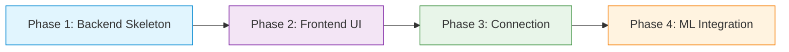

# TANUH Clinical Document AI: Detailed Phased Implementation Plan

Based on the recommended "Mock-Driven Development" approach, this document breaks the entire project down into four distinct, chronological phases. Following this flow ensures you build a stable application without getting blocked by complex ML bugs early on.

---

## The Development Flow



---

## Phase 1: Backend Skeleton (The Mock API)
**Goal**: Create a FastAPI server that can accept a `.wav` file and return fake (mock) processing data. This allows the frontend to be built and tested independently.

**Step-by-Step Execution**:
1.  **Setup Environment**:
    ```bash
    mkdir backend && cd backend
    python -m venv venv
    venv\Scripts\activate   # On Windows
    pip install fastapi uvicorn python-multipart
    ```
2.  **Create `main.py`**:
    Write a simple FastAPI script with two endpoints.
    *   `POST /api/upload`: Accepts an `UploadFile`. Instead of doing any ML, it just generates a random `task_id` (e.g., using Python's `uuid`) and returns it: `{"task_id": "mock-1234", "status": "processing"}`.
    *   `GET /api/status/{task_id}`: Write a mock logic block. If the task was created less than 5 seconds ago, return `{"status": "PROCESSING", "message": "Transcribing..."}`. If it's older than 5 seconds, return `{"status": "COMPLETED", "data": {"transcript": "Mock transcript", "topics": ["Fever", "Cough"], "summary": "Patient has a mild fever."}}`.
3.  **Run and Test**:
    ```bash
    uvicorn main:app --reload
    ```
    Open `http://localhost:8000/docs` (Swagger UI) to test your mock upload and status endpoints manually.

---

## Phase 2: Frontend Implementation (React UI)
**Goal**: Build the sleek, TANUH-branded user interface without worrying about API connections yet.

**Step-by-Step Execution**:
1.  **Initialize React**:
    ```bash
    npm create vite@latest frontend -- --template react
    cd frontend
    npm install react-router-dom lucide-react axios
    ```
2.  **Setup the Theme (Vanilla CSS)**:
    Create a `global.css` file. Define your TANUH color palette (primary colors, glassmorphism backgrounds, shadows) and import a modern font like 'Inter' from Google Fonts.
3.  **Build the Navigation**:
    Create a persistent `<Navbar />` component with routing links to: Home, Clinical Document, Steps, and About Us.
4.  **Build the Static Pages**:
    *   **Home Page**: Create a Hero section with a bold title and a "Try Clinical AI" button.
    *   **Steps & About Us**: Build these as simple informational views.
5.  **Build the Clinical Document Shell**:
    Create the `ClinicalDocument.jsx` page. Design three visual states (using React state variables like `const [view, setView] = useState('upload')`):
    *   *Upload View*: A styled dropzone for `.wav` files.
    *   *Loading View*: A modern spinner with dynamic text.
    *   *Result View*: Beautifully styled cards for the Transcript, Topics, and Summary. (Hardcode the text into the HTML for now just to style it).

---

## Phase 3: Frontend Connection (The Handshake)
**Goal**: Connect your beautiful React UI to the mock FastAPI backend using a polling mechanism.

**Step-by-Step Execution**:
1.  **CORS Configuration**:
    Go back to your FastAPI `main.py` and add CORS middleware so your `localhost:5173` React app is allowed to talk to `localhost:8000`.
2.  **Implement the Upload**:
    In `ClinicalDocument.jsx`, attach an `onChange` handler to your file input. Use `axios.post` to send the file to `http://localhost:8000/api/upload` using `FormData`. 
3.  **Implement the Polling Loop**:
    When the POST request returns a `task_id`, save it to a state variable.
    Write a `useEffect` hook that triggers when `task_id` exists:
    ```javascript
    useEffect(() => {
        if (!taskId) return;
        
        const interval = setInterval(async () => {
            const res = await axios.get(`http://localhost:8000/api/status/${taskId}`);
            if (res.data.status === 'COMPLETED') {
                setResults(res.data.data); // Save mock transcript/topics to state
                clearInterval(interval);   // Stop polling
                setView('results');        // Switch UI to show the cards
            } else {
                setLoadingMessage(res.data.message); // Update UI spinner text
            }
        }, 2000); // Poll every 2 seconds

        return () => clearInterval(interval);
    }, [taskId]);
    ```
4.  **Test the Flow**: Drop a file in the React UI. Watch the spinner appear, wait 5 seconds, and watch the UI transition smoothly to your styled Results cards filled with the mock data!

---

## Phase 4: ML Integration (The Brains)
**Goal**: Swap out the fake backend data with Celery and your actual Hugging Face ML Tracks.

**Step-by-Step Execution**:
1.  **Setup Docker & Redis**:
    Create a `docker-compose.yml` file to spin up Redis (the message broker) and your Celery worker. Map your `~/.cache/huggingface` folder in the compose file so weights load instantly.
2.  **Port the ML Code**:
    Copy your `Track1_SD`, `Track2_ASR`, `Track3_TI`, and `Track4_DS` folders into the backend repository. 
    Modify them slightly so that instead of reading from a hardcoded directory of data, they are functions that accept a single `audio_path` string and return data.
3.  **Create the Celery Worker (`worker.py`)**:
    Write the function that defines the pipeline:
    ```python
    @celery_app.task
    def process_audio(file_path):
        rttm = run_track1(file_path)
        transcript = run_track2(file_path, rttm)
        topics = run_track3(transcript)
        summary = run_track4(transcript)
        return {"transcript": transcript, "topics": topics, "summary": summary}
    ```
4.  **Update FastAPI (`main.py`)**:
    Replace your mock upload logic with: `task = process_audio.delay(saved_file_path)`.
    Replace your mock status logic with: `task = celery_app.AsyncResult(task_id)` and return `task.result` when it is successful.
5.  **Final End-to-End Test**:
    Open your React UI. Upload a real medical audio file. The UI will poll FastAPI, FastAPI will check Redis, the Celery worker will run Tracks 1-4 using the Hugging Face cache, and finally, your React frontend will beautifully render the real clinical document!
